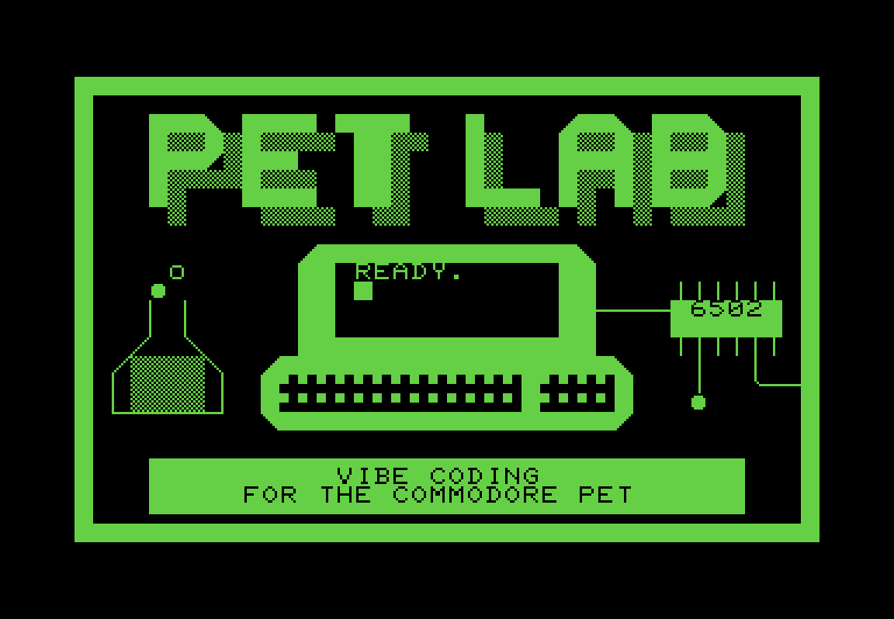

# Pet Lab

**Vibe coding for the Commodore PET.**

*Describe the program you want in plain English. An AI writes it, tests it,
and hands you a program that runs on your real PET.*

<p align="center">
  
  <br><em>This title screen was designed by an AI agent in Pet Lab, in BASIC, checking its own screenshots as it went.
  (<a href="examples/">source and prompt</a>)</em>
</p>

"Vibe coding" means programming by describing what you want instead of
writing the code yourself: *"make a maze game where I steer with the number
keys"*. An AI does the writing and the debugging, and you play the result.

Pet Lab brings that to a 1977 Commodore PET 4032. It runs in Docker on any
computer you have lying around: a desktop, an old laptop, a NAS. Inside
it is an emulated PET (BASIC 4.0, 32 KB of RAM, a 40×25 green screen, no
sound chip) that the AI uses the way you would. It types on the keyboard,
watches the screen, `LOAD`s and `RUN`s programs, and drops into a debugger
when something breaks. When the program works, you load it on your
**real** PET.

> **Where this is going.** Today Pet Lab is the half of the project that
> runs on your PC: the emulated PET, the AI tools and the agent. The other
> half connects it to a real PET through a **PETdisk MAX** (a modern
> SD-card and Wi-Fi drive for the PET), so you can type your request **on
> the PET's own keyboard** and the finished program shows up on the PET's
> drive, ready to `LOAD` and `RUN`. That part is being built and tested on
> real hardware now. Once it works end to end, this project will look
> quite different from the outside: less "an emulator in a box", more
> "talk to your PET and it writes its own software". Expect this page to
> change a lot.

> **You:** Make a program called BOUNCE: a ball that bounces around the
> screen, in machine code, called from BASIC until I press a key.
>
> **Claude:** *(writes BASIC and 6502 assembly, assembles it, loads it into
> the PET, sets a breakpoint on the move routine, single-steps one call,
> checks screen memory, tests every corner)*
> `LOAD"BOUNCE",9` then `RUN`. A ball moves diagonally and bounces off all
> four edges. Any key stops it. Stepped one call at the breakpoint: the
> ball went from X14,Y10 to X13,Y9; screen memory showed 81 at the new cell
> and a space at the old one. Not tested: how smooth it looks on a real
> screen.

That exchange is real. The agent did it with nothing but Pet Lab's MCP
tools. The program, and the title screen above, are in
[`examples/`](examples/).

## What's inside

- **A PET that stays on.** The MCP server keeps one emulated PET running
  between tool calls, so an agent can load a program, poke at it, set a
  breakpoint, look around, and carry on. It never has to reboot to try the
  next thing.
- **Eyes on the screen.** The screen comes back as text (with PET graphics
  and reverse video marked) or as an image the model can look at.
- **A real debugger.** Breakpoints, single-stepping, registers, memory
  dumps, disassembly. Tools that run the PET never continue past a
  breakpoint behind the agent's back; the stop is reported with the
  registers.
- **Three ways to program.** BASIC 4.0 (tokenized with petcat), 6502
  assembly (ACME, xa65, ca65) and C (cc65 with its PET target).
- **A reference that's been checked.** A [programmer's reference for the
  PET 4032](pet-ref/) where every fact says how it's known: read from the
  actual ROMs, tested in the emulator, or taken from documentation. Plus
  disassemblies of the BASIC, editor and KERNAL ROMs. It's why the agent
  knows the PET has no `ELSE`, no C64-style `SETLFS`, and exactly 91 BASIC
  keywords.
- **Works with any MCP client.** Claude Code is built in, and Claude
  Desktop or any other MCP client can connect from outside the container.
- **`petrun`** for scripted, one-shot tests: run a program, type keys, check
  the screen, fail on `?SYNTAX ERROR`.

## Quick start

You need Docker. Pet Lab runs on anything from a laptop to a NAS with an
Atom CPU.

```bash
git clone https://github.com/Magic-of-Jafo/pet-lab.git
cd pet-lab
docker compose up -d --build        # first build takes a few minutes
```

Check it works (23 checks, about a minute):

```bash
docker exec pet-lab /opt/petlab-venv/bin/python /opt/petlab/tests/mcp_smoke.py
```

Then talk to the agent inside the lab:

```bash
docker exec -it pet-lab claude      # log in once; your login is kept in ./home
```

and ask for something:

```
Make a snake game for my PET. Test it in the emulator before you hand it over.
```

Your programs land in `./workspace/programs`.

### Use it from Claude Desktop (or any MCP client)

Point your client at the server inside the container. For Claude Desktop,
add this to `claude_desktop_config.json`:

```json
{
  "mcpServers": {
    "pet": {
      "command": "docker",
      "args": ["exec", "-i", "pet-lab", "pet-mcp"]
    }
  }
}
```

Docker on another machine? Use `ssh`:
`"command": "ssh", "args": ["you@nas", "docker", "exec", "-i", "pet-lab", "pet-mcp"]`.
More in [docs/mcp.md](docs/mcp.md).

## Try it without an AI

`petrun` is handy on its own:

```bash
docker exec pet-lab sh -c 'cd /workspace && cat > HELLO.BAS <<"EOF"
10 PRINT "{CLR}WHAT IS YOUR NAME";
20 INPUT N$
30 PRINT "HELLO, ";N$;"!"
EOF
petrun HELLO.BAS --wait 2 --keys "ADA\r" --wait 1'
```

```
+----------------------------------------+ final
|WHAT IS YOUR NAME? ADA                  |
|HELLO, ADA!                             |
|READY.                                  |
+----------------------------------------+
NO BASIC ERRORS ON SCREEN
```

## Getting programs onto a real PET

Pet Lab writes ordinary `.PRG` files. Put them on whatever your PET reads:
an SD-card drive (SD2PET, petSD+, PETdisk MAX), a disk image for a real
drive, or a network drive.

With a **PETdisk MAX**, the PET can load straight from a folder on your
network (`LOAD"BOUNCE",9`). Making that reliable is the hardware half of
this project: fixed PETdisk firmware, a safer server script, and then
typing to the AI **from the PET's own keyboard**. That work is being tested
on real hardware and will become part of Pet Lab. See
[docs/real-pet.md](docs/real-pet.md).

## Documentation

| | |
|---|---|
| [Getting started](docs/getting-started.md) | Install, first session, workspace layout, updating |
| [MCP server](docs/mcp.md) | Every tool, connecting clients, how breakpoints behave |
| [petrun](docs/petrun.md) | The command-line tester |
| [PET reference](pet-ref/) | BASIC 4.0, memory map, KERNAL, screen, hardware, machine language, disk |
| [How it works](docs/architecture.md) | Headless VICE, the monitor protocol, design choices |
| [Real PET](docs/real-pet.md) | Moving programs to hardware, PETdisk MAX, roadmap |
| [Troubleshooting](docs/troubleshooting.md) | Build problems, NAS quirks, emulator issues |

## Roadmap

- **Now:** the PC half: emulated PET 4032, MCP server, petrun, reference,
  examples.
- **Next:** the hardware half: PETdisk MAX firmware fixes tested on a real
  PET, and programs published straight to the PET's network drive.
- **Then:** vibe coding from the PET itself: type your request on the PET,
  get the program on its drive.
- **After that:** the README gets rewritten around the whole thing working
  together.
- Later: more machines (the 8032 with 80 columns, the original 2001).

Ideas and pull requests welcome: see [CONTRIBUTING.md](CONTRIBUTING.md).

## Credits

Pet Lab stands on [VICE](https://vice-emu.sourceforge.io/) (the emulator
and petcat), [cc65](https://cc65.github.io/),
[ACME](https://sourceforge.net/projects/acme-crossass/), xa65, the
[MCP Python SDK](https://github.com/modelcontextprotocol/python-sdk), and
[bitfixer's PETdisk MAX](https://github.com/bitfixer/petdisk-max).

The Commodore PET ROMs are not part of this repository. The Docker build
fetches them from the official VICE source release. Pet Lab is a hobby
project and is not affiliated with Commodore, the VICE team or bitfixer.

## License

MIT, see [LICENSE](LICENSE).
